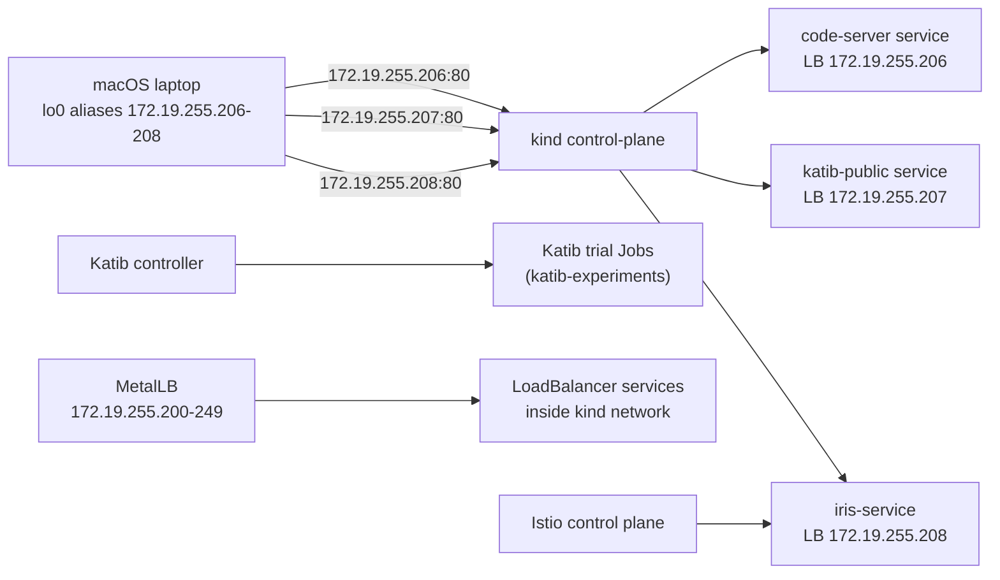

# Architecture

## Component Roles

- `kind` provides the local multi-node Kubernetes control plane.
- `MetalLB` supplies a private pool of service IPs for `LoadBalancer` services.
- `Istio` remains available for mesh and traffic management inside the cluster.
- `code-server` provides a browser-accessible development workspace.
- `Katib` runs hyperparameter searches as Kubernetes Jobs.
- `iris-ml-api` is the demo workload used to prove the platform works end to end.

## Why The External IPs Work On macOS

Docker Desktop for macOS does not expose the `kind` bridge network directly to the host. This lab makes the MetalLB addresses reachable anyway by combining:

- `lo0` aliases on the host for `172.19.255.206-208`
- matching `LoadBalancer` service IPs in Kubernetes
- `kind` host port mappings that bind port `80` on those IPs to the right service `NodePort`
