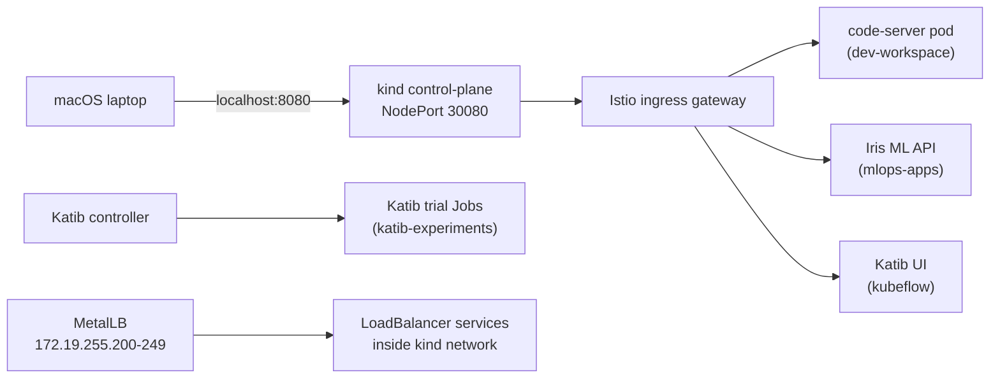

# Architecture

## Component Roles

- `kind` provides the local multi-node Kubernetes control plane.
- `MetalLB` supplies a private pool of service IPs for `LoadBalancer` services.
- `Istio` gives a single ingress point and an in-cluster service mesh path for ML services.
- `code-server` provides a browser-accessible development workspace.
- `Katib` runs hyperparameter searches as Kubernetes Jobs.
- `iris-ml-api` is the demo workload used to prove the platform works end to end.

## Why Both MetalLB And Istio

This lab uses both on purpose:

- `MetalLB` solves the Kubernetes side of local load balancers.
- `Istio` solves the application ingress and routing side.

On macOS with Docker Desktop, the `kind` Docker network is not directly exposed to the host. Because of that, the MetalLB addresses are valid and useful inside the cluster, but laptop access is handled through `Istio` plus `kind` host port mappings.

