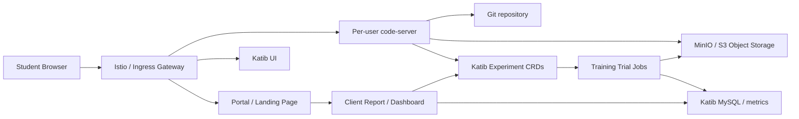
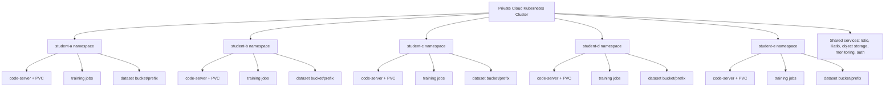

# Web-First Private Cloud Plan

## Why The Cluster Was Deleted Earlier

I deleted and recreated the local `kind` cluster because the laptop lab had drifted into an `Istio` routing failure after being left up for a while, and the fastest way to restore a clean demo state was a full rebuild.

That is acceptable only for a disposable lab.

It is not acceptable for a production-like private cloud because:

- the current storage is local to the `kind` cluster
- the current persistent volumes use a reclaim policy of `Delete`
- deleting the cluster destroys the persistent volumes and their data

This means the current laptop lab is a training environment, not a durable private cloud yet.

## What I Inspected In The Current Environment

### Docker

After cleanup, the only running Docker containers are:

- `mlops-lab-control-plane`
- `mlops-lab-worker`

I removed only stopped and unrelated old containers from other projects.

I did not delete Docker images aggressively because some of them may belong to other work or local tools.

### Kubernetes

The current cluster is healthy and running:

- `code-server`
- `Istio`
- `Katib`
- `Katib MySQL`
- the demo ML API

### Persistent Storage

The current persistent storage objects are:

- `dev-workspace/vscode-home`
- `kubeflow/katib-mysql`

Today they are backed by the default local-path storage in the cluster, which means:

- they survive normal pod restarts
- they do not survive cluster deletion
- they are not suitable yet for a serious multi-user private cloud

## Current Design Limits You Must Know

The current code-server setup is defined in:

- [vscode deployment](/Users/youseffayyaz/Documents/GitHub/ML_Ops/manifests/vscode/deployment.yaml)
- [vscode pvc](/Users/youseffayyaz/Documents/GitHub/ML_Ops/manifests/vscode/pvc.yaml)

Important limits:

- only one `code-server` pod exists
- it uses one shared home PVC
- it mounts the project through a `hostPath`
- it is not isolated per user
- it is not designed for five students running in parallel

The current Katib database is:

- one MySQL deployment in the `kubeflow` namespace
- internal only through a `ClusterIP` service
- suitable for the demo, not yet for customer-facing reporting

## What Is Actually Persistent Today

### What Survives A Pod Restart

These survive if the pod restarts but the cluster remains:

- files in the `code-server` home PVC
- Katib MySQL data in the MySQL PVC

### What Does Not Survive A Cluster Rebuild

These are lost if the cluster is deleted:

- `code-server` persistent home data
- Katib MySQL stored observation logs
- Kubernetes resource history inside the cluster

### What Must Change For A Stable Private Cloud

Before hosting real users, move persistence out of disposable local-path storage:

- use a durable storage class backed by real disks or network storage
- use external object storage for datasets and artifacts
- use an external managed database or at least a backed-up database volume

## The Web-First User Journey

Your future users should not depend on a local laptop terminal.

The browser should be the main entrypoint.



## Web-Only Procedure For A Student

This is the future workflow you should design for five students.

### Step 1: Open The Platform

The student opens the private-cloud URL in the browser and signs in.

The portal should expose:

- personal `code-server`
- Katib UI
- upload area for datasets
- list of experiments and results

### Step 2: Open Personal code-server

The student opens their own code-server workspace.

This should be:

- one pod per student
- one PVC per student
- one namespace per student or one tenant namespace with strict isolation

### Step 3: Create A Personal Python Environment

Inside the web terminal in code-server, the student creates a project-specific environment.

Example:

```bash
python3 -m venv ~/venvs/house-prices
source ~/venvs/house-prices/bin/activate
pip install -U pip
pip install -r requirements.txt
```

Why this matters:

- packages stay isolated per project
- different students can use different versions
- the environment survives pod restarts if stored on the student's PVC

### Step 4: Upload Or Access Data

For the future server scenario, the dataset should not stay only on the student's laptop.

Use one of these methods:

1. small files:
   - upload through the browser file manager inside code-server
2. reproducible course datasets:
   - store them in Git if small enough
3. real ML datasets:
   - upload them to `MinIO` or another S3-compatible object store
4. larger team datasets:
   - use pre-signed upload URLs so the browser uploads directly to object storage

For a real private cloud, object storage is the best standard answer.

### Step 5: Run The Training Code From The Browser

The student edits Python code in code-server and launches training from the web terminal.

That is still a web-only flow because the terminal is inside the browser IDE, not on the student's laptop shell.

### Step 6: Launch Katib

The student should be able to:

- apply a prepared experiment manifest from code-server
- or use a portal form that generates the Katib experiment automatically

The better long-term design is a portal form, because most students should not edit raw Kubernetes YAML.

### Step 7: Watch Results In Katib UI

The student opens Katib UI and sees:

- experiment status
- trials
- metrics
- best hyperparameters

### Step 8: View The Result In A Friendly Dashboard

For client-facing or professor-facing output, Katib UI alone is not enough.

You should add a results portal that shows:

- experiment name
- owner
- dataset version
- metric history
- best hyperparameters
- best trial output
- links to trained model artifacts

## How People Install Packages In code-server

There are three levels of package installation.

### Level 1: Per-Project Python Virtual Environments

This is the safest default for students.

Use:

- `python -m venv`
- `pip`
- optionally `uv`

Advantages:

- no conflict between students
- no conflict between projects
- reproducible with `requirements.txt`

### Level 2: Per-User Tooling In The Home PVC

This is good for reusable user tools such as:

- Python extensions
- local CLI helpers
- personal notebooks

These should live in the user's own PVC-backed home directory.

### Level 3: Global Base Image Packages

This should be used only for common defaults:

- `python3`
- `pip`
- `git`
- `curl`
- build tools
- basic ML libraries if you want a standard image

Do not let students install random packages globally into the shared container filesystem and expect stability.

The production answer is:

- build a standard base image
- let each user create project virtual environments on top of it

## How Multiple Students Should Work In Parallel

For five students, the right model is not one shared code-server pod.

Use:

- one namespace per student
- one code-server pod per student
- one PVC for each student's home directory
- one service account per student
- resource quotas per namespace
- limit ranges per namespace
- network policies between namespaces



## Kubernetes Scalability For code-server

`code-server` itself is just a web IDE running in a container.

Scalability depends on:

- CPU and memory per user pod
- storage performance of the PVCs
- how many training jobs run in parallel
- whether students use heavy libraries like PyTorch

For five students, one small cluster is reasonable if you set limits.

Example policy direction:

- each code-server pod: 1 CPU, 2 to 4 GiB RAM
- each student namespace: resource quota
- training jobs: queued or limited parallelism

If everyone trains models at once, the training jobs matter more than the IDE pods.

## How To Handle Data That Starts On A Laptop

In the future private cloud, do not rely on laptop-local datasets.

Correct model:

1. student uploads dataset from browser
2. upload lands in object storage
3. training code reads the dataset from object storage
4. model artifacts are written back to object storage
5. Katib only tunes the training job parameters

Bad model:

- keeping the source dataset only on the student's laptop
- mounting laptop folders into a remote cluster

That approach does not scale and is not reliable.

## How Katib Saves Hyperparameter Data Today

Today the data is split across two places.

### Kubernetes CRDs

The experiment and trial definitions are stored as Kubernetes resources.

That includes:

- experiment spec
- objective
- search space
- best trial summary in status

### Katib MySQL

The Katib MySQL database stores observation logs.

In the current lab, I verified that the `katib` database contains the `observation_logs` table with fields:

- `trial_name`
- `id`
- `time`
- `metric_name`
- `value`

For the current demo, a row exists for the Iris trial metric:

- `trial_name = iris-random-search-86bhk69l`
- `metric_name = accuracy`
- `value = 0.9667`

This is useful because it shows the metric persistence layer is real, not only visual.

## How To Show Katib Results To Clients Later

Do not expose the raw MySQL database directly to clients.

Better options:

### Option 1: Results API

Build a backend service that reads:

- Katib CRDs from Kubernetes
- metric observations from MySQL

Then expose a clean API to your portal.

### Option 2: Sync To A Reporting Store

Push experiment summaries into:

- PostgreSQL
- ClickHouse
- a warehouse
- `MLflow`
- or a model registry/reporting service

This is easier for dashboards and long-term history.

### Option 3: Client Dashboard

Build a dashboard that shows:

- experiment history
- best hyperparameters
- best metric values
- trial counts
- dataset version
- model version

For serious private-cloud service delivery, this dashboard matters more than the raw Katib UI.

## What Must Change Before You Host Five Students

### Storage

Replace local-path-only persistence with durable storage.

### User Isolation

Use namespace isolation, quotas, and per-user service accounts.

### Authentication

Use real login and RBAC.

### Data Layer

Use object storage for datasets and model artifacts.

### Results Layer

Add a reporting API and dashboard.

### Images

Stop using floating tags like `latest` for critical workloads.

### Database

Back up Katib's database and treat it as stateful infrastructure.

### Workspace Model

Move from one shared code-server to one workspace per user.

## What To Do Next Technically

I recommend this sequence:

1. keep the current laptop lab only for prototyping
2. add durable object storage such as `MinIO`
3. add a per-user code-server architecture
4. add namespace quotas and network policies
5. move Katib MySQL to backed-up durable storage
6. add a results API and dashboard
7. only then move to the real housing regression project for multi-user testing

## Learning Materials

### Official Documentation

- code-server FAQ: <https://coder.com/docs/code-server/FAQ>
- Kubernetes multi-tenancy docs: <https://kubernetes.io/docs/concepts/security/multi-tenancy/>
- Katib overview: <https://www.kubeflow.org/docs/components/katib/overview/>
- Katib UI guide: <https://www.kubeflow.org/docs/components/katib/user-guides/katib-ui/>
- MinIO pre-signed upload guide: <https://min.io/docs/minio/linux/integrations/presigned-put-upload-via-browser.html>

### Free Learning

- Coursera MLOps learning roadmap: <https://www.coursera.org/resources/mlops-learning-roadmap>
- CNCF multi-tenant platform video via Class Central: <https://www.classcentral.com/course/youtube-running-a-multi-tenant-platform-on-a-managed-kubernetes-cluster-237664>
- Rancher Live Kubernetes multi-tenancy video: <https://opsmatters.com/videos/rancher-live-kubernetes-multi-tenancy>

### Paid Or Structured Courses

- Coursera: Machine Learning in Production: <https://www.coursera.org/learn/introduction-to-machine-learning-in-production>
- Coursera: ML Production Systems Specialization: <https://www.coursera.org/specializations/ml-production-systems>
- Udemy: KubeFlow Bootcamp: <https://www.udemy.com/course/kubeflow-bootcamp/>
- Udemy: Kubeflow Machine Learning Specialist Exam Prep: <https://www.udemy.com/course/kubeflow-machine-learning-specialist-exam-prep/>

For architecture, the best order is:

1. Kubernetes basics
2. Kubernetes multi-tenancy
3. storage and object storage
4. MLOps systems
5. Kubeflow, Katib, KServe, and model lifecycle

## Bottom Line

Today you have a solid local demonstration lab.

You do not yet have a durable multi-user private cloud.

The next correct move is not to add more models immediately.

The next correct move is to redesign:

- persistence
- user isolation
- data upload
- per-user workspaces
- result presentation

After that, the housing-price project becomes a meaningful private-cloud test instead of only a laptop demo.
