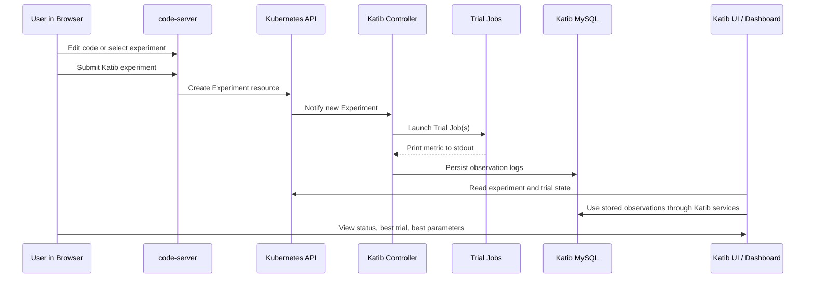
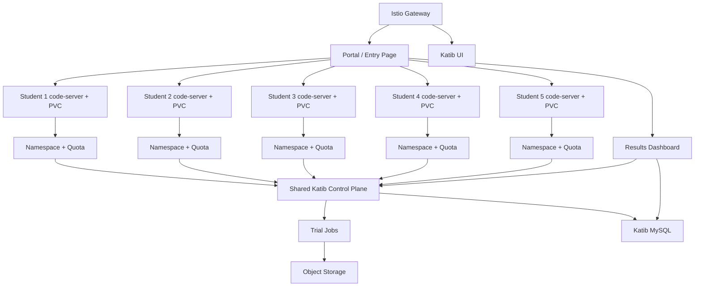

# Supervisor Brief

## Context

This brief answers the supervisor's two immediate needs:

1. understand the logic behind the deployed platform
2. define a realistic strategy for letting a small group of students use the resources

The current deployed platform exposes these public URLs:

- VS Code web IDE: `http://172.19.255.206/`
- Katib UI: `http://172.19.255.206/katib/`
- Iris demo API: `http://172.19.255.206/iris/`
- House-prices demo API: `http://172.19.255.206/housing/`
- Results dashboard: `http://172.19.255.206/results/`

## Executive Summary

The current system is a working MLOps demonstration platform on Kubernetes. It already proves the important logic:

- users can access a web IDE
- an ML service can run in Kubernetes
- Katib can launch optimization trials
- users can inspect results in Katib UI and in a friendlier dashboard

However, the current setup is still a lab system, not yet a multi-user private cloud. It is good for a demonstration and a pilot, but it needs tenant isolation, durable storage, and stronger operational controls before it is offered to students as a stable service.

## What The Platform Actually Does

### Main Components

- `kind`: local Kubernetes cluster
- `Istio`: public entrypoint and routing layer
- `code-server`: browser-based VS Code
- `Katib`: hyperparameter optimization controller
- `Katib MySQL`: metrics persistence for Katib observations
- results dashboard: browser-friendly summary of experiments
- demo applications:
  - Iris classification
  - house-prices regression

### Core Logic

The platform separates responsibilities:

- users develop code in code-server
- training code is packaged into a container image
- Katib launches repeated training trials with different parameter values
- each trial prints a metric such as `accuracy` or `rmse`
- Katib collects the metric and compares trials
- results are visible in Katib UI and in the custom dashboard

## How A User Can Submit Jobs

This is the most important supervisor question.

### Today: Current Submission Path

Today a technical user submits jobs in one of two ways:

1. through the browser-based code-server terminal
2. through a local shell with `kubectl`

The practical current workflow is:

1. open the browser IDE
2. edit the training code or select a prepared experiment YAML
3. apply the Katib `Experiment`
4. let Katib create and manage the trial jobs

So the user is not manually starting every trial. The user submits one Katib experiment, and Katib orchestrates the trial jobs.

### What The User Actually Submits

The user submits a Katib `Experiment`, not a raw training job.

The `Experiment` defines:

- optimization goal
- metric name
- search algorithm
- hyperparameter search space
- number of trials
- trial job template

### Recommended Future Submission Path

For students, raw YAML should not be the main interface.

The recommended next step is a web form or portal that asks for:

- project or template selection
- dataset selection
- metric to optimize
- parameter ranges
- number of trials

The portal should then generate the Katib experiment automatically.

This would let non-expert users submit jobs fully through the web.

## How A User Can Check Results

This is the second supervisor question.

### Current Result Interfaces

Users can check results in two ways:

1. Katib UI
2. the custom results dashboard

### Katib UI

Katib UI is useful for:

- experiment status
- trial list
- best trial
- metric evolution
- parameter values

It is the native interface for Katib.

### Results Dashboard

The custom dashboard is useful because it is simpler for presentations and less technical users.

It currently shows:

- experiment name
- current status
- best trial name
- best metric
- best hyperparameters
- number of succeeded trials
- creation time

This is already closer to what a professor or stakeholder expects than raw Kubernetes objects.

## Sequence Of A Typical Run

## Limitations Of The Current Tooling

The current system has clear limitations that must be stated honestly.

### User And Workspace Limits

- only one code-server deployment exists today
- it is not isolated per student
- it is not suitable yet for five simultaneous users

### Storage Limits

- workspace data and Katib MySQL data are persistent only inside the current cluster
- if the cluster is deleted, the current lab persistence is lost
- this is acceptable for a demo, not for a service platform

### Submission Limits

- current submission is still technical
- a user must know how to choose or apply an experiment definition
- there is no self-service form-based portal yet

### Data Limits

- there is no proper object-storage workflow yet for user-uploaded datasets
- the platform is not yet designed for long-lived user datasets or model artifacts

### Operational Limits

- no multi-tenant RBAC model is implemented yet
- no quotas per student are enforced yet
- no backup policy is documented for Katib data
- no production monitoring and alerting layer is exposed to users

## What The Current Demo Already Proves

Even with the limitations above, the current demo already proves the logic of the platform:

- web-based development is possible
- web-based experiment inspection is possible
- Katib can optimize both a toy classification task and a more tangible house-prices regression task
- a custom dashboard can present results in a stakeholder-friendly way

This is enough for a demonstration of concept and for a small pilot discussion.

## Strategy For Letting Students Use The Resources

This is the key topic for the Tuesday meeting.

### Target Scope

Initial target:

- 5 students
- controlled pilot
- no sensitive production data
- fixed project templates

### Recommended Strategy

Use a staged rollout instead of opening the current lab directly.

#### Phase 1: Controlled Pilot

Provide:

- one namespace per student
- one code-server workspace per student
- one PVC per student home directory
- one shared Katib control plane
- one shared results dashboard
- one shared object storage system

This gives:

- isolation
- fair resource use
- traceability of experiments
- low operational complexity

#### Phase 2: Better Self-Service

Add:

- login and RBAC
- a web form to create Katib experiments
- dataset upload to object storage
- per-student experiment history
- per-student quotas

#### Phase 3: More Production-Like Service

Add:

- durable storage
- backed-up database
- monitoring and alerting
- a model artifact registry
- client-facing reporting

## Recommended Student Architecture

## What Must Change Before Students Use It

These are the minimum changes required before treating this as a usable student platform.

### 1. Per-Student Workspaces

Move from one shared code-server pod to one code-server per student.

### 2. Namespace Isolation

Each student needs:

- namespace
- quota
- service account
- network policy

### 3. Durable Storage

Replace the current disposable local-path-only persistence with storage that survives cluster lifecycle operations.

### 4. Dataset Handling

Provide object storage for:

- uploads
- datasets
- model artifacts
- outputs

### 5. Simpler Submission UX

Introduce a guided portal for experiment submission instead of requiring students to write raw Katib YAML.

### 6. Reporting

Keep Katib UI for technical users, but provide a simpler dashboard for supervisors and students.

## Answers To Expected Supervisor Questions

### How can the user submit jobs?

Today:

- by submitting a Katib experiment from the browser IDE or local shell

Future student version:

- through a web portal that generates Katib experiments from a form

### How can the user check the results?

Today:

- Katib UI
- custom results dashboard

Future student version:

- dashboard first
- Katib UI for advanced details

### Are there limitations to use the tool?

Yes.

Main current limitations:

- current workspace is single-user in practice
- current persistence is not durable enough for a real service
- submission is still too technical
- dataset handling is not yet production-grade
- results presentation is only partially polished

### Is the current system enough for five students?

Not as-is.

It is enough as a prototype and pilot foundation, but it needs per-student workspaces, quotas, storage, and better submission UX first.

## Suggested Discussion Outcome For Tuesday

The recommended message in the meeting is:

1. the current platform is a valid proof of concept
2. job submission and result inspection logic are already demonstrated
3. the current system should not yet be offered directly as a stable multi-user platform
4. the next milestone is a controlled five-student pilot with isolated workspaces and durable storage

## Concrete Next Actions

1. freeze the current lab as the demonstration baseline
2. define one namespace and one code-server instance per student
3. add object storage for datasets and outputs
4. move Katib data onto backed-up durable storage
5. add a simple web submission flow for experiments
6. keep the dashboard as the supervisor-facing result view

## Bottom Line

The current platform already answers the supervisor's conceptual questions:

- users submit optimization jobs by creating Katib experiments
- users check results through Katib UI and the custom dashboard
- the system is functional, but still limited by single-user assumptions and non-durable lab storage

The correct strategy is not to over-claim that the current lab is ready for students.

The correct strategy is to present it as:

- already functional for demonstration
- structurally correct as an MLOps foundation
- requiring one more design step to become a small private-cloud teaching platform
