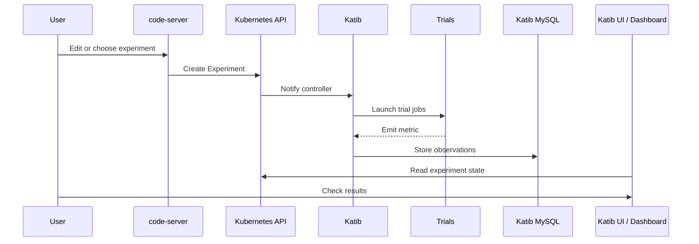
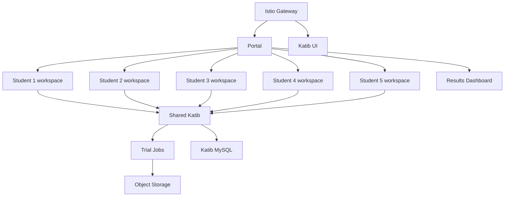

# Supervisor Briefing

## Katib Demo And Student Pilot Strategy

- Current platform: Kubernetes + code-server + Katib + dashboard
- Goal: explain tool logic and define a safe path for student usage

---

# Current Public Entry Points

- VS Code: `http://172.19.255.206/`
- Katib UI: `http://172.19.255.206/katib/`
- House-prices API: `http://172.19.255.206/housing/`
- Results dashboard: `http://172.19.255.206/results/`

---

# What The Platform Proves Today

- Browser-based development works
- Katib can launch optimization trials
- Users can inspect best hyperparameters
- Results can be shown in a simpler dashboard
- Both a toy case and a real house-prices case are available

---

# How A User Submits Jobs

Today:

- user opens code-server
- user selects or edits a Katib Experiment
- user submits the Experiment
- Katib creates and manages the trial jobs

Key point:

- the user submits one optimization request
- Katib handles the trial orchestration

---

# What The User Actually Submits

A Katib `Experiment` contains:

- objective metric
- optimization goal
- search space
- search algorithm
- trial template

Katib then creates:

- Trial objects
- Kubernetes Jobs

---

# How A User Checks Results

Current result interfaces:

- Katib UI for technical details
- custom dashboard for presentation-friendly summaries

Dashboard currently shows:

- experiment name
- status
- best trial
- best metric
- best hyperparameters

---

# Current Logic

---

# Current Limitations

- one code-server workspace in practice
- no per-student isolation
- no self-service form-based submission yet
- storage is still lab-grade, not durable service-grade
- no full tenant model for multiple students

---

# Why The Current Lab Is Not Yet A Student Platform

- cluster rebuild can destroy important state
- storage is not yet designed for service continuity
- users still need technical knowledge for job submission
- data upload flow is not yet production-grade

Conclusion:

- good demonstration
- not yet a stable teaching service

---

# Recommended 5-Student Strategy

- one namespace per student
- one code-server pod per student
- one PVC per student
- shared Katib control plane
- shared dashboard
- shared object storage
- quotas and limits per student

---

# Recommended Architecture

---

# What Must Be Added Before Student Usage

- per-student workspaces
- namespace isolation
- quotas and service accounts
- durable storage
- object storage for datasets and outputs
- backed-up database
- simpler web submission UX

---

# Answers To Supervisor Questions

How can the user submit jobs?

- today: via Katib Experiment submission
- future: via a portal form that generates the Experiment

How can the user check results?

- today: Katib UI and results dashboard
- future: dashboard first, Katib UI for advanced detail

Are there limitations?

- yes, especially multi-user isolation and durability

---

# Recommended Meeting Outcome

- present the current platform as a working proof of concept
- confirm that the job logic and result logic are already demonstrated
- propose a controlled five-student pilot
- agree that durability and multi-tenancy are the next engineering milestone

---

# Bottom Line

The platform is already valid for demonstration.

The next step is not more feature growth.

The next step is turning the current lab into a safe, isolated, durable pilot platform for a small group of students.
